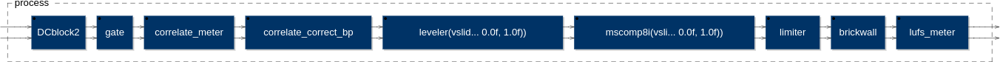

# master_me

Better sound for live-streaming.





## Build LADSPA, LV2, VST2, VST3 and JACK Standalone

Requirements: OpenGL2 capable graphics card (or software rendering via MESA on Linux)

```
git submodule update --init --recursive
make
```

## Build "legacy" generic faust UI for JACK and run

```
$ faust2jack soundsgood.dsp
$ ./soundsgood
```
